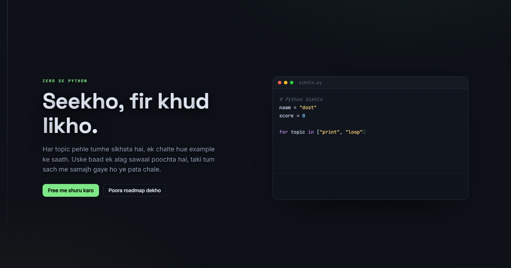

# Python Sikhlo

Ek dynamic website jisse Python zero se seekh sakte ho. **55 topics, 12 chapters**, print se
lekar async tak. Har topic pehle **sikhata** hai (Hinglish explanation + chalta hua example),
fir usse **alag sawaal** ka test leta hai. Code browser me hi chalta hai, aur ek AI dost har
sawaal ka jawab deta hai.



## Chalao

```bash
python learn.py --serve      # website  ->  http://localhost:8777/index.html
python learn.py              # terminal version (work.py edit karo, Enter dabao)
python learn.py --test       # self-check: har topic, har lesson, accounts API
python learn.py --web        # levels.js dubara banao (topic badalne ke baad)
```

Sirf Python chahiye, koi pip install nahi. Pehli baar browser Pyodide CDN se Python download
karta hai (internet chahiye), uske baad tumhara code browser me hi chalta hai.

## Roadmap

| Chapter | Topics |
|---|---|
| Basics | print, variables, maths, type casting, strings, f-strings, booleans, operators, if-else, ternary, lists, slicing, for, while, break/continue, nested loops, tuples, sets, dicts |
| Functions | def, docstrings, default args, *args/**kwargs, lambda/map/filter, scope, type hints, sorting, comprehensions |
| Errors | try, except, raise |
| Modules | import, math, random |
| Files | open, read, write, with |
| Regex | findall, sub, patterns |
| OOP | classes, dunder methods, inheritance, super(), encapsulation |
| Advanced | generators, decorators, closures, context managers, collections, dataclasses |
| DSA | recursion, stack, queue, linear + binary search, sorting, hashmaps, linked list |
| Concurrency | async/await, threading, the GIL, multiprocessing |
| Testing | assert, test functions |
| Tools | pip, venv, requirements, mypy |

Teen track hai. **Beginner** level 1 se (koi function nahi jab tak level 20 use na sikhaye),
**Medium** level 20 se, **Advanced** level 37 se. Kisi bhi topic pe click karke seedha wahi
se shuru kar sakte ho.

## Account aur progress

Login server pe hota hai, progress `users.json` me disk pe. Browser clear karo ya doosra
browser kholo, points aur solved topics wahi rehte hai. Password PBKDF2 se hash hota hai,
aur `users.json` git me kabhi nahi jata.

Server sirf `127.0.0.1` pe sunta hai. Internet pe daalne se pehle HTTPS aur login pe
rate-limit zaroori hai.

## Vercel pe live karna

Site static hai, par login, progress aur chatbot ke liye server chahiye. `api/index.py` ek
Python serverless function hai jo saare `/api/...` calls sambhalta hai, aur accounts Supabase
me jate hai. Vercel ka filesystem har request ke baad reset ho jata hai, isliye wahan file me
account save karna kaam nahi karta.

Database ka pata (`SUPABASE_URL`) `vercel.json` me hai aur code me bhi default hai, kyunki wo
secret nahi hota. Sirf **ek** cheez daalni padti hai:

1. **Repo import karo** Vercel pe. Framework "Other", build command khali. `vercel.json` khud
   bata deta hai ki kya build karna hai.
2. **Secret key daalo**: Settings -> Environment Variables -> `SUPABASE_SERVICE_ROLE_KEY`.
   Value Supabase -> Project Settings -> API Keys -> Secret keys (`sb_secret_...`) se aati hai.
   Publishable key se kaam nahi chalega, RLS use rokti hai.
3. **Table banao** (project ke naye hone pe ek hi baar): Supabase SQL editor me
   `supabase/schema.sql` chala do.
4. Optional, chatbot ke liye: `OPENAI_API_KEY` ya `ANTHROPIC_API_KEY`.

Deploy ke baad `/api/health` khud bata deta hai ki database juda hai ya nahi, aur kya missing
hai. Key na ho toh login saaf mana kar deta hai, chup chaap signup lekar data pheknta nahi.

Local pe: `.env` me wahi do cheezein daal do (`.env.example` dekho). Key na ho toh local
`users.json` use karta hai, isliye bina database ke bhi sab chalta rehta hai.

## AI dost (chatbot)

Chatbot aur "har baar nayi baat" wale messages ek API key se chalte hai. Key server pe rehti
hai, page me kabhi nahi jati. **OpenAI ya Anthropic, dono chalti hai** - server key dekh ke
khud pehchan leta hai:

```bash
# ek file banao (git ise ignore karta hai)
echo sk-proj-...   > ai_key.txt     # OpenAI  -> gpt-4.1
echo sk-ant-...    > ai_key.txt     # Anthropic -> claude-opus-5
```

Fir server restart karo. Ab:

- **Galat jawab pe** tumhara code padh ke us waqt likha gaya hint milta hai, rata hua nahi.
- **Sahi jawab pe** us solution ke hisaab se nayi shabaashi milti hai.
- **Dost se poochho** button se kuch bhi poochh sakte ho. Jis level pe ho uska poora jawab wo
  nahi dega (khud solve karna hi asli baat hai), baaki har sawaal ka deta hai.

Key na ho, ya account me credit na ho, toh site poori chalti rehti hai: har topic ka apna
likha hua hint, aur messages jo kabhi lagatar repeat nahi hote. Dikkat kya hai wo saaf
sentence me batata hai, JSON dump nahi.

## Files

- `learn.py` — engine: checker, accounts server, AI routes, terminal game.
- `curriculum.py` + `curriculum_extra.py` — saare 55 topics: lesson, example, test, hint, bonus.
- `index.html` — website: hero, roadmap, practice app, chatbot. Plain HTML, CSS, JS.
- `levels.js` — `python learn.py --web` se banta hai. Topic badlo toh ye command dubara chalao.
- `api/index.py` — poora backend: accounts, storage (Supabase/Upstash/file), AI routes.
  Local server bhi yahi file import karta hai, taki logic ek hi jagah rahe.
- `vercel.json` — deploy settings aur database ka pata.
- `supabase/schema.sql` — ek baar chalane wala table setup.
- `assets/` — og image.
